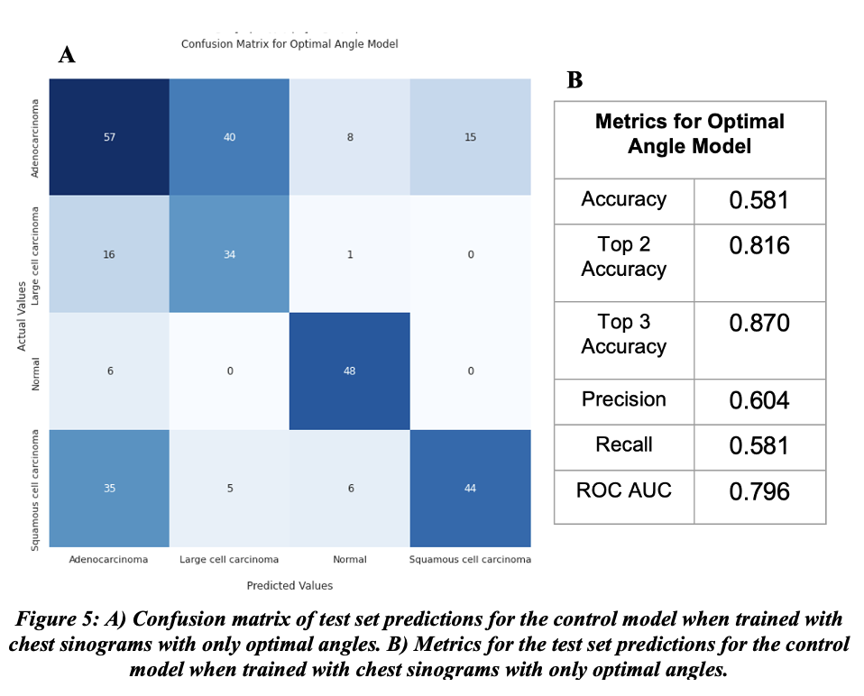

# Determining optimal angles needed for sinogram classification
## Data taken from https://www.kaggle.com/datasets/mohamedhanyyy/chest-ctscan-images
## Author: Denver Bradley
## Due Date: 04/29/2022
## Abstract

The American Cancer Society predicts that lung cancer will be the deadliest cancer and second most common type of cancer in 2022. While computed tomography (CT) scans of the chest can detect lung cancer, the process of capturing and classifying these scans could be improved. Scan time, patient radiation exposure, and storage needed can all decrease if only optimal angles were used when conducting a CT scan. This project’s aim was to find which angles of a CT scan were needed for lung cancer classification. It sought to find these angles by using deep learning, sinograms, and a physical layer that could pick which angles were most important for classification. This project saw that lung cancer could be classified with complete sinograms and sinograms that had a reduced number of angles as determined by the physical layer. The control model that used complete sinograms achieved an area under the receiver operating characteristic (ROC-AUC) of 0.743 and the model that only used optimal angles improved upon this score by achieving a ROC-AUC of 0.796.

## Introduction

The American Cancer Society predicts that 350 people will die from lung cancer within the United States in 2022. If this prediction is correct, lung cancer will be the deadliest type of cancer and the second most common type of cancer in men and women within the United States for 2022 (Siegel et al, 2022). CT scans of the chest are an effective way of detecting and diagnosing lung cancer (Yau et al., 2007). However, just one CT scan of the chest on average exposes a patient to 7 millisieverts, which is over double the average background radiation a person is exposed to over the course of a year (Harvard Health, 2021). Many times patients will be exposed to additional radiation when receiving follow-up CT scans. During a CT scan a patient is exposed to radiation at each angle of the scan. So, if the number of angles needed for a CT scan to make a proper diagnosis is reduced, then the radiation a patient receives will also be reduced. Additionally, reducing the number of angles within a CT scan will also reduce the amount of data that needs to be stored and the time a patient needs to stay in the CT scan. Reduced time a patient needs to stay within the scan will reduce patient discomfort and artifacts created from patient movement.

This project aimed to reduce the number of angles a CT scan needs to acquire for a lung cancer diagnosis by finding the optimal angles needed for lung cancer classification. This project aimed to find these optimal angles by utilizing chest sinograms, the raw data projections collected by the CT scan, and a deep neural network. A comparison was made to see if the classification of lung cancer from complete chest sinograms was similar or improved upon when compared to chest sinograms with angles, determined by a physical layer within the network, were removed.

The data set used for this project was found on Kaggle. It contained 1,000 chest CT scans. The scans were broken up into three different classes of cancer and one class for chest scans with no cancer. The three classes of cancer were adenocarcinoma, large cell carcinoma, and squamous cell carcinoma. Adenocarcinoma affects smokers, non-smokers, and former smokers and is found in the outer part of the lung. Large cell carcinoma spreads rapidly and affects all parts of the lung. Squamous cell carcinoma affects smokers and is found in the central part of the lung and bronchus. (American Cancer Society, 2019) The data set was broken into 70% train, 10% validation, and 20% test (Figure 1).

## Related Works

Three studies in the past have successfully used sinograms with deep learning architectures for either classification or segmentation tasks. One study saw promising results when using sinograms and convolutional neural networks for the detection of pulmonary nodules (Gao et al., 2019). Another study was successful in using an auto-encoder and decoder network for the detection and segmentation of blood vessels from sinograms (De man et al., 2019). Finally, a study was successful in body region identification and intercranial hemorrhage classification from sinograms and sparsely sampled sinograms (Lee et al., 2019). The network used for this study was based off Google’s Inception V3 model.

## Methods

All data pre-processing, model building, and model evaluation was conducted in Python 3.6.9 and TensorFlow 2.8.0. This projected aimed to determine what angles within a chest sinogram were most important for lung cancer classification. However, the images contained within the data set were of CT chest scans. To acquire the chest sinograms needed for this project, The CT scans were converted to sinograms through a radon transform. To perform this conversion, the radon function from the scikit-image package was utilized. Since the radon function only accepts grayscale images, the CT scans from the data set first had to be converted from RGB to grayscale.

A baseline model was then created to classify the newly created chest sinograms. The model was made of the Inception V3 model, a flatten layer, a 1024 dense layer with a Relu activation, a dropout layer with a dropout rate of 0.2, and a dense layer with a SoftMax activation and an output of 4 for the four different classes within the data set (Figure 2). The Inception V3 model was chosen because the work from Lee et al. showed that the network architecture could achieve high performance for sinogram classification. The Inception V3 layers were pre-trained with image net weights since this yielded the highest performance models when testing. Since the image net weights require RGB images as an input, the grayscale sinograms collected were repeated on two additional axes before entering the model (Figure 3A). The layers of the Inception V3 were not trainable, as this reduced run time and overfitting. Additionally, Include Top was set to false for the Inception V3. The loss used was categorical cross entropy and accuracy, precision, recall, and ROC-AUC were monitored during training. The model used an Adam optimizer and a learning rate of 0.001.  The model trained for 35 epochs with a batch size of 64. The weights from the epoch with the highest validation accuracy during training was chosen for evaluation on the test set.

Once the baseline model was evaluated, a physical layer was added to the model before the Inception V3 layers. This physical layer was used to determine the most important angles, columns within the sinogram, for lung cancer classification and delete the angles that weren’t as significant. The physical layer used a trainable variable that was initialized to one and had the same number of columns as the sinograms used. During each batch of training the weights within this variable would change. The top 75% of these weights were deemed the most important angles for sinogram classification and were left unchanged for the current batch of training. The remaining 25% of the columns were deemed as not significant for sinogram classification and were reduced by 0.5 for the current batch of training. The new values within each column were then repeated in rows to match the rows of the sinograms. These values were then repeated on two additional axes to match the color axes of the sinograms. The created values were then multiplied by the sinograms and the output of this multiplication would enter into the Inception V3 model. This multiplication of the sinogram was done because it penalizes angles deemed non-important while angles deemed important remain the same or are enhanced. The process would be repeated on the next batch, and the variable would be able to update the angles it deems important. Originally the penalty for non-important columns was set closer to 1 rather than 0.5, since a value close to 1 would reduce the columns values close to 0. A value of 0 would give a more accurate simulation of a missing angle, but this led to overfit models with high train accuracies and very low validation and test accuracies. Originally, there was also no restriction on how many angles the layer could deem unimportant, but this too led to overfitting so a restriction of only penalizing 25% of the columns was placed on the layer. The parameters for training the physical layer model were all the same as the control model, except the learning rate was decreased to 0.0005. Due to the overfitting seen from earlier testing, an early stop was put in place that monitored validation accuracy and had a patience of 5.

After training, the weights for the optimal angles were then extracted from the physical layer. Since the weights for all unimportant angles were reduced below a value 0.5 and all the important angles had weights close to 1, the extracted weights were rounded to get either values of 0 or 1. These new binary weights were then repeated in rows to match the rows of the sinograms and on axes to match the color axis of the sinograms. The repeated binary weights were then multiplied by the sinograms to form a new data set of optimal angle sinograms (Figure 3B). These newly created sparse sinograms served as a scenario where the CT scan only captured the optimal angles needed. The optimal angle sinograms were then train and tested on the control model to see how performance would change. As an additional control comparison, sinograms with 25% of their angles missing at random were trained and tested on the control model as well (Figure 3C). To reduce the chance of overfitting, both of these new models had an early stop that monitored validation accuracy and had a patience of 7.

## Results

When the model was trained and tested on complete chest sinograms, it correctly predicted the classes of 173 sinograms correctly in the test set (Figure 4A). The metrics for the control model were not high in performance (Figure 4B). The model had a low accuracy score of 0.549 and a ROC-AUC of 0.743, which is better than random guessing.

When the model was trained and tested with chest sinograms that only contained optimal angles, the model performed better than the control model. The optimal angle model correctly predicted the classes of 183 sinograms correctly (Figure 5A). All metrics for the optimal angle model were higher than the control (Figure 5B). The optimal angle model had an improved accuracy score of 0.581 and an improved ROC-AUC of 0.796. The optimal angle model had the highest precision and recall of all models tested, which means the model was the best at predicting the true positive class while minimizing false positives and false negatives. The optimal angle model’s top 2 and top 3 accuracy were by far the highest out of all models. This means the top 2 and top 3 highest probabilities of the model’s predictions were likely to be the correct class.

When the model was given chest sinograms with random angles missing, the model correctly predicted the classes of 159 sinograms correctly, which was worse than both the control model and optimal angle model (Figure 6A). Overall, the metrics for the random angle model were lower than both the control model and the optimal angle model (Figure 6B). The random angle model had the lowest accuracy score of 0.505 and the lowest ROC-AUC of 0.720.

All models tested struggled to distinguish the correct type of lung cancer from sinograms. However, all models did a good job a distinguishing between cancer and non-cancer sinograms. All three models rarely predicted a normal sinogram as a lung cancer sinogram, and rarely predicted a lung cancer sinogram as a normal sinogram. 

## Discussion

This project found that classification of lung cancer is possible with complete sinograms. Both the optimal angle model and the missing angle model had similar performance to the control model, so there is proof that lung cancer classification can be done with sinograms that have a reduced number of angles. As stated prior in this report, reducing the number of angles needed for cancer classification would reduce a patient’s time in a scan, a patient’s radiation exposure, and the data that needs to be stored. In the case of this project, the storage needed, time in scan, and radiation exposure per sinogram would theoretically be reduced by 25%. It should be noted that reducing sinogram angles would only be useful for classification of diseases, as reduced angle sinograms lead to noisy CT scans that would be hard for physicians to interpret.
While the optimal angles selected for sinogram classification improved performance in this project, the angles selected cannot be deemed as the correct optimal angles. More testing and or a cross validation would have to be performed in order to prove the significance of the angles selected within this project.

All models within this project had relatively low accuracies when classifying the sinograms. This could be due to the similarity between the types of lung cancers examined. Future projects can examine how different model architectures could improve upon this performance or see if performance changes when analyzing using the original CT scans and reconstructed CT scans from the sparse sinograms created. Additionally, future works can also examine how an increase or decrease in the number of missing angles changes performance. Since the model did well at predicting between cancer and non-cancer sinograms, future works can examine performance when predicting only cancer or not cancer classes instead of four classes used within this study.

## References

American Cancer Society. “What Is Lung Cancer?: Types of Lung Cancer.” American Cancer Society, American Cancer Society, 1 Oct. 2019, https://www.cancer.org/cancer/lung-cancer/about/what-is.html. 

De Man, Quinten, et al. “A Two‐Dimensional Feasibility Study of Deep Learning‐Based Feature Detection and Characterization Directly from CT Sinograms.” Medical Physics, vol. 46, no. 12, 2019, https://doi.org/10.1002/mp.13640. 

Gao, Yongfeng, et al. “Improved Computer-Aided Detection of Pulmonary Nodules via Deep Learning in the Sinogram Domain.” Visual Computing for Industry, Biomedicine, and Art, vol. 2, no. 1, 2019, https://doi.org/10.1186/s42492-019-0029-2. 

Google. “Advanced Guide to Inception V3  |  Cloud TPU  |  Google Cloud.” Google, Google, https://cloud.google.com/tpu/docs/inception-v3-advanced. 

Hany, Mohamed. “Chest CT-Scan Images Dataset.” Kaggle, 20 Aug. 2020, https://www.kaggle.com/datasets/mohamedhanyyy/chest-ctscan-images. 

Harvard Health. “Radiation Risk from Medical Imaging.” Harvard Health, Harvard Health, 30 Sept. 2021, https://www.health.harvard.edu/cancer/radiation-risk-from-medical-imaging. 

Lee, Hyunkwang, et al. “Machine Friendly Machine Learning: Interpretation of Computed Tomography without Image Reconstruction.” Scientific Reports, vol. 9, no. 1, 2019, https://doi.org/10.1038/s41598-019-51779-5. 

Siegel, Rebecca L., et al. “Cancer Statistics, 2022.” CA: A Cancer Journal for Clinicians, vol. 72, no. 1, 2022, pp. 7–33., https://doi.org/10.3322/caac.21708. 

Yau, Gary, et al. “Systematic Review of Baseline Low-Dose CT Lung Cancer Screening.” Lung Cancer, vol. 58, no. 2, 2007, pp. 161–170., https://doi.org/10.1016/j.lungcan.2007.07.006.
